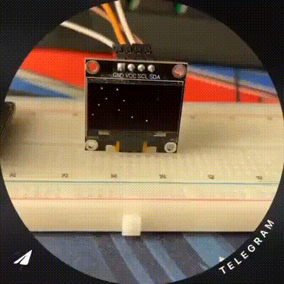

# ESP-IDF DISPLAY 

In this project I am working with the ESP-IDF library for drawing animation on an OLED display 1306. 

For drawing, I use the [u8g2](https://github.com/mkfrey/u8g2-hal-esp-idf) library, downloaded with git submodule.

## Getting Started
```bash
git clone https://github.com/0xTunay/esp-idf-display.git
cd esp-idf-display
git submodule update --init --recursive
```

Alternatively, if you're adding the submodules manually:

* Run `git clone https://github.com/mkfrey/u8g2-hal-esp-idf.git` to bring in the latest copy of this library.
* Run `git clone https://github.com/olikraus/u8g2.git` to bring in the latest copy of the u8g2 library.

P.S. The `u8g2` dir must be nested inside the `u8g2-hal-esp-idf` component, as it is expected by the HAL.

## Requirements
* ESP32 board  
* OLED display (SSD1306 over I2C)  
* ESP-IDF v4+ or higher  

## How to connect

Connect your display to the ESP32:
   
1. SDA → GPIO21  
2. SCL → GPIO22  
3. VCC → 3.3V  
4. GND → GND  

Build and flash the project:

```bash
idf.py build
idf.py flash
```

## Preview


